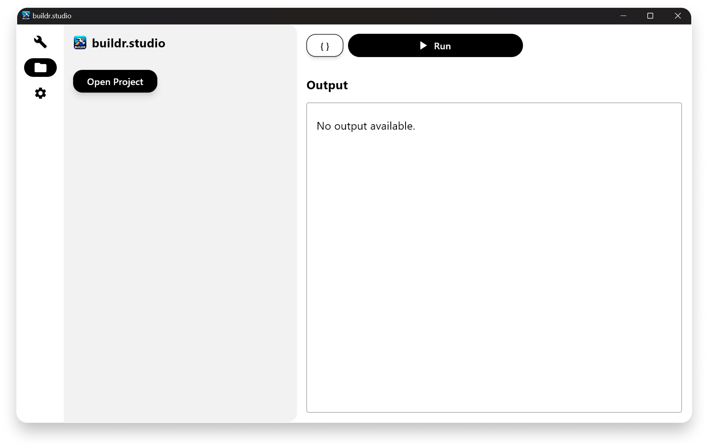

<h1 align="center"><a href="https://buildr.studio">buildr</a>.studio</h1>
<h3 align="center">The AI Toolbox to Build More in Less Time</h3>

## How to run

1. Ensure you have Flutter SDK installed and configured on your system.
2. Create a `.env` file in the root directory of the project and copy the content from the `.env.example` file.
3. Run `flutter run`.
